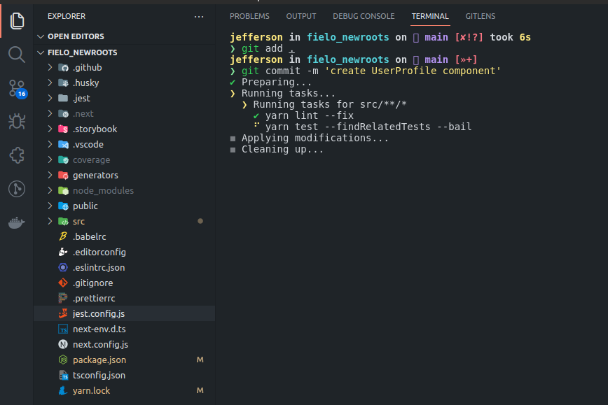

<h2 align="center">
  New Roots
</h2>

<p align="center">
  
</p>

<p align="center">
  

  

  

  
</p>

<br>

### :writing_hand: About this project
This project is for a front-end developer test for the company Fielo, it is a ReactJS SPA where it contains a list of users and when selecting the user it renders profile information and activities, this list of users as well as the information is sent after making a request in a Rest API.

> Acesse e veja o projeto clicando no link [https://front-end-test-jefferson1104.vercel.app](https://front-end-test-jefferson1104.vercel.app)


### :cyclone: Main Technologies
- [TypeScript](https://www.typescriptlang.org/docs/)
- [NextJS](https://nextjs.org/)
- [Storybook](https://storybook.js.org/)
- [Jest](https://jestjs.io/pt-BR/)
- [React-testing-library](https://testing-library.com/docs/react-testing-library/intro/)
- [Styled-Components](https://styled-components.com/)
- [Axios](https://axios-http.com/ptbr/docs/intro)
- [NProgress](https://ricostacruz.com/nprogress/)
- [Husky](https://typicode.github.io/husky)
- [ESLint](https://eslint.org/)


### :man_technologist: How to run this project
> **IMPORTANT**: Create a file called 'env.local' as in the example below, this file contains the environment variables that you will need to use to run this project on your local machine.

**env.local**
```bash
FIELO_API_URL='https://challenge-fielo.herokuapp.com'
FIELO_APP_ID='MIGfMA0GCSqGSIb3DQEBAQUAA4GNADCBiQKBgQCh7uxHjWd1CyRgPD4XHcIPKiDb'
APP_URL='http://localhost:3000'
```

follow the instructions
```bash
# Clone this repository
$ git clone https://github.com/jefferson1104/fielo_frontend_test.git

# Access the project folder
$ cd fielo_frontend_test

# Open the project in your code editor

# Install dependencies
$ yarn

# Copy the env.local file you created to the project root

# Run project
$ yarn dev

# Run storybook
$ yarn storybook

# Run tests
$ yarn test
```
### 🎨 Screenshots
<p align="center">
  
  
  
  
</p>
